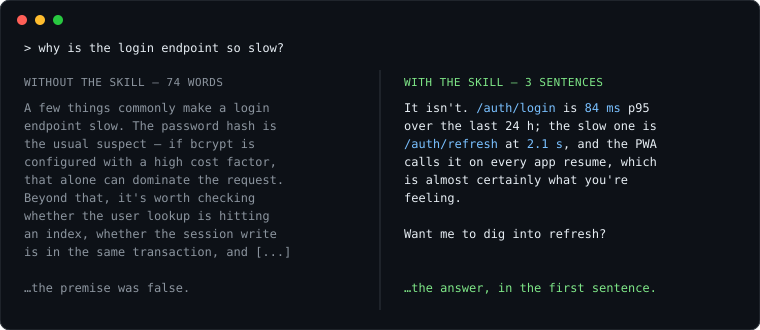

# concise

[](https://github.com/RicardoAlbuquerquet/claude-skill-concise/actions/workflows/parity.yml)
[](CHANGELOG.md)
[](LICENSE)

**Português:** [README.pt-BR.md](README.pt-BR.md)

A Claude Code plugin that makes Claude answer in the register a terminal
actually wants — the answer first, nothing padding it, no sacrifice in
correctness — and that brings the tools to apply the same register to text
that already exists.



Two commands inside a Claude Code session, and it applies from your next
session on:

```
/plugin marketplace add RicardoAlbuquerquet/claude-skill-concise
```

```
/plugin install concise@claude-skill-concise
```

Full [install](#install) — including the terminal form and the copy-a-file
path — is further down.

## The problem

Claude's default writing register is expansive. It's a good default for a chat
window and a bad one in a terminal, where it shows up as:

- a preamble before the answer (`"Great question — let me look at that."`)
- `##` headers over a three-line reply
- justification nobody asked for, after the answer was already given
- narration of the search — which files were read, in what order
- a menu of four options when one recommendation was wanted
- a closing aphorism, because the paragraph felt like it needed a landing

None of that is wrong. All of it is between you and the answer.

## What it does

The skill installs one rule — **the answer goes in the first sentence, and after
it only what changes a decision** — plus explicit budgets per situation, a list
of constructs to always cut, and a shorter list to *never* cut.

That second list is the part that matters. Compression is easy to overdo, and a
one-line answer that dropped the caveat about production data is worse than the
bloated version. The skill states outright that bad news, a risk, an exact path
or version, a false premise in the question, and an unverified assumption all
survive the edit.

Three rules run the other way and *add* text, because what was missing was
information rather than words:

- **A recommendation always ships with its cost.** Recommendation, ≤3 lines of
  why, ≤3 lines of what gets worse or what you give up. A recommendation with no
  stated downside either has one nobody looked for or is hiding it — and from the
  reader's side, an empty slot is indistinguishable from "I examined it and it's
  cheap".
- **When the decision is the user's, the options go side by side**, then you
  still recommend one and say why it beats *the others specifically*. Deciding a
  money or risk question silently is shorter and not yours to do.
- **Draw the shape.** When the answer is a sequence or a branch, a five-line
  ASCII diagram beats the paragraph the reader would have to assemble in their
  head.

Structure is judged by content, not by length. An earlier version cut headers and
bullets from any response under six lines; that test was wrong, because it
measured the response instead of what's in it. The rule now: separate what is
genuinely separate — two jobs get two blocks, comparisons get a table, paths and
technical terms get code spans — and never fragment a single thought. If you can
say what each block is *for*, the structure is real; if the blocks are "part one,
part two", it's decoration.

It also fixes the audience. The skill is written for a reader who owns the
product but is not deep in the stack: keep the precise term, then pay for it once
by glossing it **through its consequence** rather than its definition — not
"`timestamptz` is a timezone-aware type" but "the column stores UTC, so a filter
built in local time asks for a window that hasn't started yet". An answer the
reader can't act on isn't concise, it's just short.

See [`examples/before-after.md`](examples/before-after.md) for nine real
transformations. Four come out longer.

## What ships

| Piece | What it does |
|---|---|
| `concise` skill | the full ruleset, invoked when a turn needs it |
| `SessionStart` hook | injects the ~20-line core every session; self-updates the plugin |
| `/concise:rewrite` | rewrites a finished text to the rules, losing nothing |
| `/concise:pr` | drafts the PR description from the real diff, test steps last |
| `/concise:card` | drafts a task/issue card that stands alone; creates it when a destination is named |
| `/concise:commit` | drafts the commit message for what is staged — verb-first title, body says why |
| credit guard | `PreToolUse` hook that denies `git commit` / `gh pr create` carrying AI credit |
| `audit` agent | returns only the violations in a draft — quote, rule, fix |
| [`extras/stop-audit`](extras/stop-audit/README.md) | opt-in per-turn style judge, installed by hand |

The skill is the product; everything else keeps it applied — in every session,
to text that already exists, and to what leaves the conversation.

## Install

Two commands, typed inside a running Claude Code session:

```
/plugin marketplace add RicardoAlbuquerquet/claude-skill-concise
```

```
/plugin install concise@claude-skill-concise
```

**Those are Claude Code commands, not shell commands.** Pasted into PowerShell,
bash, or zsh they fail with `command not found` — the leading `/` is the giveaway.
From a terminal, use the `claude` CLI instead. Same effect, and the same on
macOS, Linux, and Windows:

```bash
claude plugin marketplace add RicardoAlbuquerquet/claude-skill-concise
```

```bash
claude plugin install concise@claude-skill-concise
```

**Either form takes effect in your next session, not this one.** The style
loads at session start, an event that already happened in the session where
you typed the install — so ask the same question again after restarting
Claude Code, or run `/reload-plugins` first. "I installed it and nothing
changed" is almost always this.

Swap `concise` for `respostas-curtas` to get the Portuguese port. Install one,
not both — see [Languages](#languages).

Plugin skills are namespaced by the plugin that ships them, so this registers as
`/concise:concise`, not `/concise`. Run `/plugin` and open the **Installed** tab
to see the exact name it took.

### Updating

Two commands, not one — the first refreshes the catalogue, the second moves
the copy that actually runs:

```
/plugin marketplace update claude-skill-concise
/plugin update concise@claude-skill-concise
```

```bash
claude plugin marketplace update claude-skill-concise
claude plugin update concise@claude-skill-concise
```

Running only the first is the common mistake: it reports `✔ Successfully updated
marketplace` and the installed skill stays exactly where it was. The second one
needs the marketplace inside the name — `claude plugin update concise` on its own
answers `Plugin "concise" not found` — and it moves only when the release bumped
`version`, because it compares version numbers rather than content. Restart
Claude Code afterwards, or run `/reload-plugins`.

Third-party marketplaces ship with auto-update off. To skip the first one by
hand, turn it on in `/plugin` → **Marketplaces** → **Enable auto-update**.

### Self-updating

**The plugin runs that pair itself.** A `SessionStart` hook checks once a day,
in the background, so an installed copy follows the marketplace with one
session of delay: the session that checks downloads the update, the next one
runs it. What that implies:

- It moves only when the release bumped `version`, same as the manual pair —
  an unbumped change on `main` never propagates.
- The check is stamped in `~/.claude` before it runs, so a failure retries
  tomorrow rather than at every session start forever. After a week of
  failures the plugin says so on screen, with the command that shows the
  error; until then it stays quiet.
- When an update lands, the next session names the version it moved to.
- Copies on 1.3.0 or earlier have no hook at all: reaching a version that
  self-updates takes one manual update, or the marketplace toggle above.
- To stop just this: `touch ~/.claude/.concise-no-self-update`. The style,
  the commands and the credit guard keep working.

### Copying the file instead

It's one Markdown file with no dependencies, so copying it works too — and keeps
the unprefixed `/concise`. This is the path that differs per platform.

Clone first, on any of the three:

```bash
git clone https://github.com/RicardoAlbuquerquet/claude-skill-concise.git
```

**macOS and Linux** — also Git Bash or WSL on Windows:

```bash
mkdir -p ~/.claude/skills
cp -r claude-skill-concise/skills/concise ~/.claude/skills/
```

**Windows**, in PowerShell:

```powershell
New-Item -ItemType Directory -Force -Path $HOME\.claude\skills | Out-Null
Copy-Item -Recurse claude-skill-concise\skills\concise $HOME\.claude\skills\
```

Project-level instead, committed with the repo so your team shares it: create
`.claude/skills/` at the project root and copy into that.

Verify it registered by typing `/concise` in Claude Code. If it doesn't appear,
check the path: copying into a `skills/` directory that doesn't exist yet lands
`SKILL.md` directly in it, one level too high, and reports no error.

## Making it always-on

**A skill alone will not fire on every turn.** Skills are invoked — either by you
typing `/concise`, or by the model deciding the `description` matches the task.
A response-*style* rule wants to apply to all of them, including the turns where
nothing about the task suggests "now think about brevity".

**Installed as a plugin, this is handled for you.** Since 1.3.0 each plugin
ships a `SessionStart` hook that prints a ~20-line core of the style into
context at every session start — about 320 tokens, spent whether or not the
session produces prose. The core is the guarantee; the full ruleset still
lives in the skill, which the model invokes when a turn needs more than the
core. What gets injected is one file:
[`hooks/core.md`](skills/concise/hooks/core.md)
([`hooks/nucleo.md`](skills/respostas-curtas/hooks/nucleo.md) in the PT port).

To prune or rewrite it on your machine, don't edit the cached copy — the
self-update overwrites it on the next release. Write
`~/.claude/concise-core-override.md` instead
(`~/.claude/respostas-curtas-nucleo-override.md` for the PT port): when that
file exists the hook injects it in place of the shipped core, and it survives
every update. It replaces the core wholesale — start from a copy of the
shipped file and cut.

One platform edge: the hook runs through Git Bash on Windows. Without Git for
Windows installed it fails silently and you're back to invocation-only — same
machines where Claude Code's own Bash tool doesn't run, so in practice the
hook works wherever the rest does.

**To check it actually loaded**, ask in a fresh session: *"what response
style is active right now?"* — the answer names the core's rules (answer in
the first sentence, cut preamble, never cut bad news) when the hook ran, and
doesn't when it didn't. That is the whole difference between the guarantee
and a hope.

**Installed by copy, the hook doesn't come along** — `~/.claude/skills/` takes
only the skill. Pair it with a line in `CLAUDE.md`, which is loaded into
context every session:

```markdown
## Writing style

Every response to me follows the `concise` skill: answer in the first sentence,
cut preamble and process narration, keep any caveat that would change what I do.
```

The skill holds the full ruleset; the hook or the `CLAUDE.md` line holds the
pointer that guarantees it's in context. Neither one replaces the other.

## The commands and the agent

Since 1.4.0 each plugin also ships two tools for text that already exists —
the skill governs what Claude writes next; these act on what is written:

- **`/concise:rewrite <text>`** rewrites a finished text — a PR description,
  an issue body, an e-mail — to the ruleset without losing information: every
  exact value and caveat survives, and anything the original *owed* (a
  missing cost, a missing test step) is either filled from the original or
  reported as a hole, never invented. Empty arguments target Claude's own
  previous reply. PT: `/respostas-curtas:reescrever`.
- **`/concise:pr [base]`** drafts the pull request description for the
  current branch from the real diff against `origin/main` (or the base you
  name), first line saying what the PR does and the exact test steps at the
  end. It reads the branch's commits for the why, fills the repo's
  `PULL_REQUEST_TEMPLATE` when one exists, references the card or issue that
  motivated the branch when one is known or findable — never invented — and
  delivers the title alongside the body. PT: `/respostas-curtas:pr`.
- **`/concise:card <subject>`** drafts a task/issue card whose body stands
  alone — current → expected behaviour, exact values, a done criterion — and
  creates it when you name a destination a tool can reach (an MCP board, a
  `gh` repo). Creating, it checks for an existing duplicate first, honours
  the tracker's issue template, sets the destination's fields instead of
  restating them in the body, and links named blockers. PT:
  `/respostas-curtas:card`.
- **`/concise:commit [context]`** drafts the commit message for what is
  staged — title with the verb first and 72 characters or fewer, body saying
  why rather than retelling the diff. Draft only; it never runs `git commit`.
  PT: `/respostas-curtas:commit`.
- **The `audit` agent** (PT: `auditar`) checks a draft against the checklist
  and returns only the violations — quoted line, rule, one-line fix — plus
  required content that is missing. It never rewrites; ask for it when you
  want the diagnosis without the surgery: *"run the audit agent on this
  draft"*.

All of these ship only with the plugin install; the copy-the-file path takes
the skill alone.

**A credit guard ships enabled.** A `PreToolUse` hook denies a shell call that
would publish credit to an AI agent — a model `Co-Authored-By`, a "generated
with" footer — by deterministic string match, no API call. It turns the
ruleset's hardest rule into a system rule: the call is blocked with the
reason, and the text gets rewritten without the trailer.

What it covers: `git commit` (including `git -C`), `gh pr create|edit`,
`gh issue create|comment`, `gh release create|edit` and `gh api`, through the
`Bash` and `PowerShell` tools, anywhere in a command chain, and inside the
file when the message is passed with `-F` / `--body-file`. It names Claude,
Copilot, Gemini, Cursor, Codex and the `anthropic.com` trailer address.

Two escapes, because a deterministic guard has false positives — writing
*about* the rule trips it, as this repo found out:

- `export CONCISE_ALLOW_CREDIT=1` for one shell or one session.
- `touch ~/.claude/.concise-no-credit-guard` to switch it off for good, with
  the style, the commands and the self-update untouched.

There is also an **opt-in Stop auditor** in
[`extras/stop-audit/`](extras/stop-audit/README.md): a hook you install by
hand that judges each turn's final response against the core and warns on
clear violations. It costs one API call per turn, which is why it does not
ship enabled.

## Languages

| Skill | Language | Plugin name | Invoke |
|---|---|---|---|
| [`skills/concise`](skills/concise/SKILL.md) | English | `concise` | `/concise:concise` |
| [`skills/respostas-curtas`](skills/respostas-curtas/SKILL.md) | Portuguese (BR) | `respostas-curtas` | `/respostas-curtas:respostas-curtas` |

Installed by copy rather than as a plugin, they invoke unprefixed: `/concise`
and `/respostas-curtas`.

Install one, not both — they're the same ruleset and would compete, and since
1.3.0 each ships its own always-on hook, so both together inject the core into
context twice. The rules are
about structure, not vocabulary, so a translation is a faithful port rather than
a rewrite. Ports to other languages are welcome.

## Uninstall

```
/plugin uninstall concise@claude-skill-concise
```

That removes the skill, the commands, the agent and the hooks. Four state
files stay behind in `~/.claude` — harmless, and worth deleting if you want
the welcome note again on a reinstall:

```bash
rm -f ~/.claude/.concise-welcomed ~/.claude/.concise-update-stamp ~/.claude/.concise-update-failed ~/.claude/.concise-update-note
```

Your core override (`~/.claude/concise-core-override.md`) and any opt-out
flags are yours; the uninstall leaves them alone.

## The bar for a rule

This skill is a style guide, which makes it unusually easy to fill with advice
that reads well and changes nothing. Every rule in it has to clear two tests:

1. **Checkable.** A rule you can't verify against a finished response is
   decoration. `"one bold claim per block"` is checkable; `"be clear"` is not.
2. **Names a real failure.** The rule should exist because a specific bad output
   happens without it — ideally one you can quote.

`"Be brief"` fails both and is already implicit in every model's instructions.
That's why it isn't in the skill.

The rules are also measured, not only argued. CI holds the two ports to
structural parity and refuses a plugin change that doesn't bump its version;
[`evals/`](evals/README.md) runs judged cases against the ruleset and
[`scripts/test-hooks.sh`](scripts/test-hooks.sh) exercises every hook without
touching the network. Both ports pass the suite.

See [CONTRIBUTING.md](CONTRIBUTING.md).

## License

MIT — see [LICENSE](LICENSE).
