<p align="center">
  <picture>
    <source media="(prefers-color-scheme: dark)" srcset="docs/brand/banner-dark.pt-BR.svg">
    
  </picture>
</p>

<p align="center">
  <a href="https://github.com/RicardoAlbuquerquet/claude-skill-concise/actions/workflows/parity.yml"></a>
  <a href="CHANGELOG.md"></a>
  <a href="LICENSE"></a>
  <a href="README.md"></a>
</p>

<p align="center">
  Um plugin de Claude Code que faz o Claude responder no registro que um terminal quer —<br>
  <b>a resposta primeiro, nada enchendo, e toda ressalva que muda o que você faz mantida.</b>
</p>

<p align="center">
  <a href="#instalação">Instalação</a>&nbsp;&nbsp;·&nbsp;&nbsp;<a href="#o-que-ela-faz">O que ela faz</a>&nbsp;&nbsp;·&nbsp;&nbsp;<a href="#o-que-embarca">O que embarca</a>&nbsp;&nbsp;·&nbsp;&nbsp;<a href="#os-comandos-e-o-agente">Comandos</a>&nbsp;&nbsp;·&nbsp;&nbsp;<a href="#o-critério-para-uma-regra">O critério para uma regra</a>
</p>

<br>

<picture>
  <source media="(prefers-color-scheme: dark)" srcset="docs/brand/before-after-dark.pt-BR.svg">
  
</picture>

## Instalação

Dois comandos, digitados dentro de uma sessão aberta do Claude Code:

```
/plugin marketplace add RicardoAlbuquerquet/claude-skill-concise
```

```
/plugin install respostas-curtas@claude-skill-concise
```

> [!IMPORTANT]
> **Vale na próxima sessão, não nesta.** O estilo carrega no início da sessão,
> evento que já passou naquela em que você digitou o install — reinicie o
> Claude Code, ou rode `/reload-plugins`, e pergunte de novo. "Instalei e não
> mudou nada" é quase sempre isso.

**São comandos do Claude Code, não de shell.** Colados no PowerShell, bash ou
zsh, falham com `command not found` — a `/` na frente entrega. De um terminal, o
CLI `claude` faz o mesmo no macOS, Linux e Windows:

```bash
claude plugin marketplace add RicardoAlbuquerquet/claude-skill-concise
```

```bash
claude plugin install respostas-curtas@claude-skill-concise
```

Troque `respostas-curtas` por `concise` para o original em inglês — um ou
outro, nunca os dois ([por quê](#idiomas)). Skill de plugin ganha o prefixo do
plugin que a embarca, então esta registra como
`/respostas-curtas:respostas-curtas`; `/plugin` → **Installed** mostra o nome
exato que ela tomou.

<details>
<summary><b>Atualizando</b> — dois comandos, e por que só o primeiro não muda nada</summary>
<br>

O primeiro atualiza o catálogo, o segundo move a cópia que de fato roda:

```
/plugin marketplace update claude-skill-concise
/plugin update respostas-curtas@claude-skill-concise
```

```bash
claude plugin marketplace update claude-skill-concise
claude plugin update respostas-curtas@claude-skill-concise
```

Rodar só o primeiro é o erro comum: ele responde `✔ Successfully updated
marketplace` e a skill instalada fica exatamente onde estava. O segundo precisa
do marketplace dentro do nome — `claude plugin update respostas-curtas` sozinho
responde que o plugin não foi encontrado — e só move quando a release subiu a
`version`, porque ele compara números de versão e não conteúdo. Reinicie o
Claude Code depois, ou rode `/reload-plugins`.

Marketplace de terceiro vem com auto-update desligado. Para dispensar o
primeiro comando manual, ligue em `/plugin` → **Marketplaces** → **Enable
auto-update**.

</details>

<details>
<summary><b>Auto-atualização</b> — o plugin roda esse par sozinho, uma vez por dia</summary>
<br>

Um hook `SessionStart` checa uma vez por dia, em segundo plano, então uma cópia
instalada segue o marketplace com uma sessão de atraso: a sessão que checa
baixa a atualização, a seguinte roda com ela. O que isso implica:

- Só move quando a release subiu a `version`, igual ao par manual — mudança
  sem bump na `main` nunca propaga.
- A checagem é carimbada em `~/.claude` antes de rodar, então uma falha tenta
  de novo amanhã em vez de a cada início de sessão para sempre. Depois de uma
  semana falhando, o plugin avisa na tela com o comando que mostra o erro;
  até lá fica quieto.
- Quando uma atualização entra, a sessão seguinte diz para qual versão foi.
- **Dentro deste repositório o carimbo do dia é ignorado** e a checagem roda a
  cada sessão. Quem publica as versões é a única pessoa que anda mais rápido
  que uma vez por dia, e cache de marketplace velho é também o que deixa o
  botão de atualizar cinza no cliente. Em qualquer outro lugar, vale uma
  checagem por dia.
- Cópias na 1.3.0 ou antes não têm hook nenhum: alcançar uma versão que se
  auto-atualiza leva um update manual, ou o toggle do marketplace acima.
- Para parar só isso: `touch ~/.claude/.respostas-curtas-no-self-update`. O
  estilo, os comandos e a guarda de crédito continuam.

</details>

<details>
<summary><b>Copiando o arquivo</b> — sem plugin, cópia no projeto, ou outro agente</summary>
<br>

É uma pasta de arquivos Markdown sem dependências, então copiar também funciona — e mantém
o `/respostas-curtas` sem prefixo. Esse é o caminho que muda por plataforma.

Clone primeiro, em qualquer uma das três:

```bash
git clone https://github.com/RicardoAlbuquerquet/claude-skill-concise.git
```

**macOS e Linux** — também Git Bash ou WSL no Windows:

```bash
mkdir -p ~/.claude/skills
cp -r claude-skill-concise/skills/respostas-curtas ~/.claude/skills/
```

**Windows**, no PowerShell:

```powershell
New-Item -ItemType Directory -Force -Path $HOME\.claude\skills | Out-Null
Copy-Item -Recurse claude-skill-concise\skills\respostas-curtas $HOME\.claude\skills\
```

Em nível de projeto, versionado com o repositório para o time compartilhar:
crie `.claude/skills/` na raiz do projeto e copie para dentro.

**Em outro agente** — Cursor, Copilot, Codex, Windsurf e os demais que leem
arquivos `SKILL.md` — as regras viajam pelo [skills.sh](https://skills.sh):

```bash
npx skills add RicardoAlbuquerquet/claude-skill-concise
```

Só as regras viajam. O output style forçado, o núcleo, o lembrete por turno, o
auto-update, as guardas, os treze comandos e o agente de auditoria são
maquinaria de plugin do Claude Code; em outro agente você fica com o documento
e invoca à mão.

Confira que registrou digitando `/respostas-curtas` no Claude Code. Se não
aparecer, cheque o caminho: copiar para um `skills/` que ainda não existe
deixa o `SKILL.md` direto nele, um nível acima do certo, sem erro nenhum.

</details>

## O problema

O registro padrão de escrita do Claude é expansivo. É um bom padrão numa janela
de chat e um ruim num terminal, onde aparece como:

- um preâmbulo antes da resposta — `"Ótima pergunta — deixa eu ver isso."`
- cabeçalhos `##` sobre uma resposta de três linhas
- justificativa que ninguém pediu, depois de a resposta já ter sido dada
- narração da busca — quais arquivos foram lidos, em que ordem
- um cardápio de quatro opções quando se queria uma recomendação
- um aforismo de fechamento, porque o parágrafo pareceu pedir um pouso

Nada disso é errado. Tudo isso fica entre você e a resposta.

## O que ela faz

A skill instala uma regra — **a resposta vem na primeira frase, e depois dela só
o que muda uma decisão** — mais orçamentos por situação, uma lista de
construções para sempre cortar, e uma lista mais curta para *nunca* cortar. O
orçamento é por turno, não por assunto: cada bloco depois do primeiro se paga
pelo que deixa a pessoa fazendo, e é isso que impede uma resposta que não quebra
nenhuma regra sozinha de chegar três vezes maior do que devia.

**A segunda lista é a parte que importa.** Compressão é fácil de exagerar, e uma
resposta de uma linha que derrubou a ressalva sobre dados de produção é pior que
a versão inchada. Notícia ruim, risco, caminho ou versão exatos, premissa falsa
na pergunta e suposição não verificada sobrevivem todos à edição.

Três regras correm no sentido contrário e *acrescentam* texto, porque o que
faltava era informação e não palavras:

- **Recomendação sempre sai com o custo dela.** Recomendação, ≤3 linhas de
  motivo, ≤3 linhas do que piora ou do que se abre mão. Do lado de quem lê,
  desvantagem ausente é indistinguível de "examinei e é barato".
- **Quando a decisão é sua, as opções vão lado a lado** — e o Claude ainda
  recomenda uma, dizendo por que ela ganha *das outras especificamente*. Decidir
  em silêncio uma questão de dinheiro ou risco é mais curto e não cabe a ele.
- **Desenhe o formato.** Quando a resposta é uma sequência ou uma bifurcação, um
  diagrama ASCII de cinco linhas ganha do parágrafo que você teria que montar na
  cabeça.

**Ela chega ao código que o Claude escreve.** Comentário carrega só o que o
código não diz — nunca a edição que o produziu — e a tela diz cada coisa uma
vez: sem subtítulo ecoando o título, sem placeholder ecoando o rótulo, verbo em
todo botão. A consequência de uma ação irreversível, o valor com que alguém
decide e o nome acessível ficam.

**As regras são escritas como crenças, desejos e intenções**: o que o Claude
tem como verdade sobre quem lê, o meio e ele mesmo, para que serve cada
resposta, e o que ele se compromete a fazer em todo turno. O `SKILL.md` guarda o
que vale em toda resposta, em menos de 300 linhas, e cada texto que sai da
conversa tem arquivo próprio, lido pelo comando que o escreve — então uma sessão
que compacta ainda traz de volta as regras que mais importam.

<details>
<summary><b>Estrutura, público e jargão</b> — como as regras decidem o que fica na página</summary>
<br>

**A estrutura se julga pelo conteúdo, não pelo tamanho.** Uma versão anterior
cortava cabeçalho e bullet de qualquer resposta com menos de seis linhas; esse
teste estava errado, porque media a resposta em vez do que há nela. A regra
agora: separe o que é genuinamente separado — duas funções ganham dois blocos,
comparação ganha tabela, caminho e termo técnico ganham code span — e nunca
fatie um pensamento só. Se você consegue dizer para que serve cada bloco, a
estrutura é real; se os blocos são "parte 1, parte 2", é enfeite.

**Ela também fixa o público.** A skill é escrita para quem é dono do produto mas
não é profundo na stack, e cada termo passa por duas perguntas, nesta ordem.
*A pessoa vai esbarrar nele de qualquer jeito* — digitar, clicar, aprovar a
mudança? Se não vai, a frase diz o que a coisa faz e não nomeia. Se vai, o termo
fica e você paga por ele uma vez, explicando **pela consequência** e não pela
definição — não "`timestamptz` é um tipo com fuso" e sim "a coluna guarda em
UTC, então filtro montado no horário local pede uma janela que ainda não
começou". Uma glosa por resposta é o teto: o segundo termo pedindo explicação é
a resposta carregando o formato da investigação em vez do da resposta. E tirar
um termo não é ficar vago — "a coluna guarda a hora em UTC" é exato sem ele;
"tem uma questão de fuso" jogou a informação fora e manteve o tamanho. Resposta
em que a pessoa não consegue agir não é concisa, é só curta.

**O mesmo teste traça a linha para o outro lado.** Nome tirado do fonte — uma
tabela, um método interno, uma constante — não é termo técnico e não tem glosa
para dar, então sai, a menos que quem lê vá abrir, rodar ou conferir aquele
número. Cortar esses é a edição rara que deixa a frase mais clara ao mesmo
tempo que a deixa mais curta.

</details>

Veja [`examples/before-after.md`](examples/before-after.md): dez transformações
reais. Quatro delas saem mais longas.

## O que embarca

| | Peça | O que faz |
|---|---|---|
| **O estilo** | Skill `respostas-curtas` | as regras em crenças, desejos e intenções, invocadas quando o turno pede; as de PR, card, commit, changelog, comentário e código ficam em `referencias/`, lidas pelo comando que escreve cada uma |
| | Hook `SessionStart` | diz o shell desta máquina para os blocos de comando, acrescenta o seu override do núcleo quando existe; auto-atualiza o plugin |
| | Output style `respostas-curtas` | o mesmo núcleo no system prompt, forçado enquanto o plugin está ligado |
| | Lembrete por turno | hook `UserPromptSubmit` que relembra o estilo em uma linha ao lado de cada mensagem |
| **O que sai da conversa** | `/respostas-curtas:pr` | escreve a descrição da PR pelo diff real, teste no fim |
| | `/respostas-curtas:commit` | rascunha a mensagem de commit do staged — título na forma que o log do repo usa, corpo com o porquê |
| | `/respostas-curtas:card` | rascunha o card que se sustenta sozinho; cria quando o destino é nomeado |
| | `/respostas-curtas:comentario` | rascunha comentário de revisão, resposta em thread ou recado em card — a afirmação, e a linha que prova |
| | `/respostas-curtas:release` | rascunha a entrada de changelog e o corpo da release dos commits desde a última tag — o que quebra primeiro |
| **Pensar em voz alta** | `/respostas-curtas:plano` | rascunha o plano para aprovação — passos que nomeiam arquivo ou comando, o risco, o que fica de fora |
| | `/respostas-curtas:decidir` | opções vivas lado a lado com os custos, e ainda uma recomendação |
| | `/respostas-curtas:desenhar` | desenha a forma em ASCII — um traço só, nada passando de 72 colunas; recusa quando o assunto não merece |
| | `/respostas-curtas:status` | escreve o update como delta desde o último, notícia ruim no topo |
| | `/respostas-curtas:passagem` | passa o trabalho adiante: estado completo, toda ressalva por inteiro, as armadilhas, o comando que retoma |
| **Texto que já existe** | `/respostas-curtas:reescrever` | reescreve um texto pronto pelas regras, sem perder nada |
| | `/respostas-curtas:enxugar` | tira o texto morto do código e da tela — comentário que repete o código, texto que repete a tela |
| | `/respostas-curtas:auditar` | roda o agente de auditoria num rascunho, arquivo ou corpo de PR e repassa o relatório |
| | Agente `auditar` | devolve só as violações de um rascunho — citação, regra, correção |
| **Guardas** | Guarda de crédito | hook `PreToolUse` que nega `git commit` / `gh pr create` com crédito de IA |
| | Desvio da PR para o comando | hook `PreToolUse` que barra o primeiro `gh pr create` da sessão para apontar o `/respostas-curtas:pr`; repetir a chamada segue |
| | [`extras/stop-audit`](extras/stop-audit/README.md) | juiz de estilo por turno, opcional, instalado à mão |

A skill é o produto; o resto a mantém aplicada — em toda sessão, no texto que
já existe, e no que sai da conversa.

## Sempre ligada

**Uma skill sozinha não dispara em todo turno.** Skill é invocada — por você
digitando `/respostas-curtas`, ou pelo modelo decidindo que a `description`
combina com a tarefa. Uma regra de *estilo* de resposta quer valer em todos,
inclusive nos turnos em que nada na tarefa sugere "agora pense em brevidade".

**Instalada como plugin, o estilo vem forçado, em duas camadas** — a segunda
segura onde a primeira enfraquece:

| Camada | Onde entra | Quando |
|---|---|---|
| **Output style**, forçado | o system prompt | toda request — e o Claude Code relembra o modelo do estilo ativo no meio da conversa |
| **Lembrete por turno**, por um hook `UserPromptSubmit` | ao lado da sua mensagem, fora do histórico visível | toda mensagem |

O output style carrega o núcleo de ~65 linhas, cerca de 1.600 tokens, de um
arquivo só: [`hooks/nucleo.md`](skills/respostas-curtas/hooks/nucleo.md)
([`hooks/core.md`](skills/concise/hooks/core.md) no port em inglês); o CI falha
quando os dois divergem. O lembrete é uma linha, uns 430 caracteres por turno.
Um hook `SessionStart` acrescenta só a linha que diz o seu shell, e o seu
override do núcleo quando existe. As regras completas continuam na skill, que o
modelo invoca quando o turno pede mais que o núcleo.

> [!WARNING]
> **Forçar sobrescreve o seu próprio output style.** Com o plugin ligado, ele
> substitui o que você escolheu — Explanatory, Learning, ou o seu — e se outro
> plugin ligado também forçar um, vale o primeiro carregado, e o núcleo só chega
> na sessão com `CONCISE_INJECT_CORE=1`. Desligar o plugin é o caminho de volta;
> o lembrete por turno tem [a própria chave](#os-comandos-e-o-agente).

> [!TIP]
> **Para conferir que carregou mesmo**, pergunte numa sessão nova: *"que estilo
> de resposta está ativo agora?"* A resposta nomeia as regras do núcleo —
> resposta na primeira frase, corte preâmbulo, nunca corte notícia ruim —
> quando o hook rodou, e não nomeia quando não rodou.

<details>
<summary><b>Reescrevendo o núcleo, rodando sem shell, e instalação por cópia</b></summary>
<br>

**Para podar ou reescrever o núcleo na sua máquina**, não edite a cópia do
cache — o auto-update sobrescreve na release seguinte. Escreva
`~/.claude/respostas-curtas-nucleo-override.md`
(`~/.claude/concise-core-override.md` no port em inglês): quando esse arquivo
existe, o hook injeta ele a cada início de sessão, e ele sobrevive a toda
atualização. O output style forçado continua levando o núcleo embarcado, então
o override entra por cima dele — escreva as regras que você muda, e diga qual
regra embarcada cada uma substitui.

**Sem shell, o estilo continua de pé.** No Windows os hooks rodam pelo Git
Bash, e sem o Git for Windows instalado eles falham em silêncio — o lembrete, o
override e as guardas ficam mudos, nas mesmas máquinas onde a própria
ferramenta Bash do Claude Code não roda. O output style forçado não precisa de
shell, então o estilo continua no system prompt ali. Um Claude Code antigo
demais para conhecer o `force-for-plugin` ignora a chave; aí escolha o estilo
em `/config` → **Output style** → `respostas-curtas:respostas-curtas`, ou
`export CONCISE_INJECT_CORE=1` para o hook imprimir o núcleo no início da sessão.

**Instalada por cópia, o hook não vem junto** — `~/.claude/skills/` leva só a
skill. Emparelhe com uma linha no `CLAUDE.md`, que é carregado no contexto a
cada sessão:

```markdown
## Estilo de escrita

Toda resposta para mim segue a skill `respostas-curtas`: resposta na primeira
frase, corte preâmbulo e narração de processo, mantenha toda ressalva que
mudaria o que eu faço.
```

A skill guarda as regras completas; o hook ou a linha no `CLAUDE.md` guarda o
ponteiro que garante que elas estão no contexto. Um não substitui o outro.

</details>

## Os comandos e o agente

A skill governa o que o Claude escreve a seguir. Os comandos produzem um texto
específico sob demanda — saia ele da conversa ou fique nela — ou agem sobre o
que já está escrito. O núcleo injetado nomeia os comandos, para o Claude buscar
um sem ninguém mandar; é empurrão disputando atenção com todo o resto do
contexto, e o comando que você digita continua sendo a única garantia.

**Tudo é rascunho por padrão.** Nada é publicado sem você dizer, na própria
invocação:

| Comando | Vai além do rascunho só quando |
|---|---|
| `/respostas-curtas:pr [base] [create]` | você digita `create` — abre a PR com exatamente o título e o corpo rascunhados |
| `/respostas-curtas:commit [contexto] [run]` | você digita `run` — commita exatamente a mensagem rascunhada |
| `/respostas-curtas:card <assunto>` | você nomeia um destino que uma ferramenta alcança — um board por MCP, um repo via `gh` |
| `/respostas-curtas:comentario [assunto]` | você nomeia o destino *e* manda publicar |
| `/respostas-curtas:release [versão]` | nunca — sem `gh release create`, sem tag empurrada |
| `/respostas-curtas:status [onde]` · `/respostas-curtas:passagem [quem]` | nunca — nomear um canal ou uma pessoa não é permissão para enviar |
| `/respostas-curtas:plano [assunto]` | nunca — não entra em plan mode nem começa o passo 1 |
| `/respostas-curtas:enxugar [caminhos]` | sempre — cortar o texto é o trabalho, então ele edita os arquivos; nunca commita |
| `/respostas-curtas:reescrever` · `/respostas-curtas:decidir` · `/respostas-curtas:desenhar` · `/respostas-curtas:auditar` | nunca — só texto |

<details>
<summary><b>Cada comando por inteiro</b></summary>
<br>

- **`/respostas-curtas:reescrever <texto>`** reescreve um texto pronto — uma
  descrição de PR, um corpo de issue, um e-mail — pelas regras, sem perder
  informação: todo valor exato e ressalva sobrevive, e o que o original
  *devia* (um custo faltando, um passo de teste faltando) ou é preenchido a
  partir do original ou é reportado como buraco, nunca inventado. Sem
  argumento, o alvo é a resposta anterior do próprio Claude. EN:
  `/concise:rewrite`.
- **`/respostas-curtas:enxugar [caminhos]`** tira o texto morto do código —
  o comentário que repete a linha de baixo ou descreve a edição, código
  comentado, e na tela a segunda vez que a mesma coisa é dita, o botão sem
  verbo, a palavra de tom. Sem argumento, o alvo são os arquivos que a branch
  mudou. Texto visível muda junto com os testes, snapshots e idiomas que casam
  com ele, ou fica e é reportado; diretiva, cabeçalho de licença e nome
  acessível nunca saem. Roda as checagens do repo e nunca commita. EN:
  `/concise:trim`.
- **`/respostas-curtas:pr [base] [create]`** escreve a descrição da PR da
  branch atual a partir do diff real contra `origin/main` (ou a base que você
  nomear): o que está sendo resolvido, o que foi feito, como testar, com os
  passos de teste exatos no fim. Lê os commits da branch atrás do porquê,
  preenche o `PULL_REQUEST_TEMPLATE` do repo quando existe, referencia o card
  ou a issue que motivou a branch quando é conhecido ou encontrável — nunca
  inventado — e entrega o título junto do corpo. Só rascunho, a não ser que
  você digite a palavra `create`: aí ela abre a PR com exatamente o título e
  o corpo rascunhados e reporta a URL. EN: `/concise:pr`.
- **`/respostas-curtas:card <assunto>`** rascunha um card de tarefa/issue com
  corpo que se sustenta sozinho — comportamento atual → esperado, valores
  exatos, critério de pronto — e cria quando você nomeia um destino que uma
  ferramenta alcança (um board por MCP, um repo via `gh`). Na criação,
  procura duplicata antes, honra o template de issue do tracker, preenche os
  campos do destino em vez de repeti-los no corpo, e linka bloqueadores
  nomeados. EN: `/concise:card`.
- **`/respostas-curtas:commit [contexto] [run]`** rascunha a mensagem de
  commit do que está staged — título de 72 caracteres ou menos, na forma que
  o log do repo já usa, com a área primeiro quando o repo tem mais de uma, e
  corpo dizendo o porquê em vez de recontar o diff. Só rascunho, a não ser
  que você digite a palavra `run`: aí ela commita exatamente a mensagem
  rascunhada e reporta o sha curto. EN: `/concise:commit`.
- **`/respostas-curtas:comentario [assunto]`** rascunha comentário de revisão,
  resposta em thread, recado no card de alguém ou mensagem para uma pessoa: a
  afirmação primeiro, depois o `caminho:linha` que prova, se trava ou não dito
  dentro do comentário, e um ponto por comentário — vários pontos voltam como
  vários blocos. Lê a linha ou a thread antes de escrever, e para em vez de
  chutar quando não alcança. Só rascunho, a não ser que você nomeie o destino
  *e* mande publicar. EN: `/concise:comment`.
- **`/respostas-curtas:release [versão]`** rascunha a entrada de changelog — e
  o corpo da release quando você está cortando uma — dos commits desde a
  última tag: o que muda para quem instala, o que quebra primeiro com a
  migração na mesma entrada, e o número da versão junto da única mudança que
  força ele. Lê o changelog existente atrás da forma que aquele arquivo já
  usa, e nunca roda `gh release create` nem empurra tag. EN:
  `/concise:release`.
- **`/respostas-curtas:plano [assunto]`** rascunha o plano que você propõe:
  passos numerados que nomeiam o arquivo que tocam ou o comando que rodam, o
  risco nomeado, o que fica de fora, e o que ele precisa de você antes do
  passo 1 em bloco próprio. Lê os arquivos que os passos apontam e marca os
  que não conseguiu verificar. Só texto — não entra em plan mode e não começa
  o passo 1. EN: `/concise:plan`.
- **`/respostas-curtas:decidir [decisão]`** monta uma decisão que é sua —
  dinheiro, risco, qualquer coisa irreversível — com as opções vivas lado a
  lado e o que cada uma custa, e ainda recomenda uma, argumentada contra as
  alternativas especificamente, mais a condição que viraria a recomendação.
  Custo que ela não conseguiu verificar volta marcado como não verificado em
  vez de arredondado. EN: `/concise:decide`.
- **`/respostas-curtas:desenhar [assunto]`** desenha a forma em ASCII — setas
  rotuladas com o que passa e o que custa, caixas rotuladas pelo que fazem em
  vez do nome interno — depois de ler a fonte de cada salto. Carrega quatro
  layouts canônicos (fluxo, bifurcação, antes/depois, árvore de chamadas) e
  as regras de acabamento: um conjunto de traços, nada passando de 72
  colunas, todo rótulo pendurado na caixa que ele nomeia, falha abaixo da
  linha principal, repetição como contagem, sem legenda; mermaid só onde a
  superfície renderiza e o grafo é de fato bidimensional. Recusa quando o
  assunto não merece desenho (uma função, uma lista de três itens, a figura de
  uma frase que já está na tela) e diz isso em vez de desenhar assim mesmo.
  EN: `/concise:draw`.
- **`/respostas-curtas:status [onde]`** escreve o update: só o delta desde o
  último, notícia ruim no topo, o que depende de você em bloco próprio, e
  quando sai o próximo. Acha o update anterior e confere o que andou de
  verdade — `git log`, a execução de CI — em vez de lembrar. Só rascunho;
  nomear um canal não é permissão para publicar. EN: `/concise:status`.
- **`/respostas-curtas:passagem [quem]`** passa o trabalho adiante — o oposto
  exato de um update de status, e é por isso que é comando separado. Onde o
  status larga o que quem lê já tem, a passagem assume que a pessoa não tem
  nada: a branch, o sha, a PR e o estado dela; o que está pronto e verificado
  separado do que falta com o critério de pronto; **toda ressalva de pé de
  volta por inteiro** em vez de apontada; as armadilhas que só você sabe
  nomear; o que foi decidido e por quê; e o comando exato que retoma o
  trabalho. Lê `git status`, o log e as PRs abertas em vez de lembrar. Só
  rascunho; nomear quem assume não é permissão para enviar. EN:
  `/concise:handoff`.
- **`/respostas-curtas:auditar [alvo]`** roda o agente de auditoria num
  rascunho, num caminho de arquivo, ou no corpo de PR ou issue que ele busca,
  e repassa o relatório como ele voltou — linha de veredito, violações
  numeradas, buracos — seguido de uma linha com a chamada de
  `/respostas-curtas:reescrever` que corrigiria tudo. Nunca reescreve, nunca
  edita o arquivo, e nunca publica correção. EN: `/concise:audit`.
- **O agente `auditar`** (EN: `audit`) confere um rascunho contra o checklist
  e devolve só as violações — linha citada, regra, correção em uma linha —
  mais o conteúdo obrigatório que falta. Nunca reescreve; peça quando quiser o
  diagnóstico sem a cirurgia: *"rode o agente auditar nesse rascunho"*.

Tudo isso vem só com a instalação por plugin; o caminho da cópia leva a skill
sozinha.

</details>

**Uma guarda de crédito vem ligada.** Um hook `PreToolUse` nega a chamada de
shell que publicaria crédito a agente de IA — `Co-Authored-By` de modelo,
rodapé "generated with" — por comparação determinística de string, sem chamada
de API. A chamada é barrada com o motivo, e o texto sai reescrito sem o rodapé.
Ela cobre `git commit` (inclusive `git -C`), `gh pr create|edit`,
`gh issue create|comment`, `gh release create|edit` e `gh api`, pelas
ferramentas `Bash` e `PowerShell`, em qualquer ponto de uma corrente, e dentro
do arquivo quando a mensagem vem por `-F` / `--body-file`. Ela nomeia Claude,
Copilot, Gemini, Cursor, Codex e o endereço de trailer `anthropic.com`.

**Um segundo hook `PreToolUse` desvia a descrição de PR para o comando que a
escreve.** O primeiro `gh pr create` — ou `gh pr edit --body` — da sessão é
negado uma vez, com o motivo nomeando o `/respostas-curtas:pr`; repita a
chamada e ela passa. Descrição escrita de memória tendo um comando para ler o
diff, o log e o template é a falha que ele existe para pegar, e um hook que
continuasse negando seria uma parede sem saída. Ele não enxerga PR aberta no
navegador — nenhum plugin enxerga — então repo que abre PR pelo github.com põe
essa linha no próprio `PULL_REQUEST_TEMPLATE`.

Tudo em volta do estilo desliga sozinho, sem mexer nele — guarda determinística
tem falso positivo, e escrever *sobre* a regra dispara ela, como este repo
descobriu:

| Para parar | Num shell ou numa sessão | De vez |
|---|---|---|
| o lembrete por turno | `export CONCISE_NO_TURN_REMINDER=1` | `touch ~/.claude/.respostas-curtas-no-turn-reminder` |
| a guarda de crédito | `export CONCISE_ALLOW_CREDIT=1` | `touch ~/.claude/.respostas-curtas-no-credit-guard` |
| o desvio da PR | `export CONCISE_NO_ROUTE_HINT=1` | `touch ~/.claude/.respostas-curtas-no-route-hint` |
| o auto-update | — | `touch ~/.claude/.respostas-curtas-no-self-update` |

Há também um **auditor de Stop opcional** em
[`extras/stop-audit/`](extras/stop-audit/README.md): um hook que você instala
à mão e que julga a resposta final de cada turno contra o núcleo, avisando em
violação clara. Custa uma chamada de API por turno — por isso não vem ligado.

## Idiomas

| Skill | Idioma | Nome do plugin | Invocação |
|---|---|---|---|
| [`skills/respostas-curtas`](skills/respostas-curtas/SKILL.md) | Português (BR) | `respostas-curtas` | `/respostas-curtas:respostas-curtas` |
| [`skills/concise`](skills/concise/SKILL.md) | Inglês | `concise` | `/concise:concise` |

Instaladas por cópia em vez de plugin, invocam sem prefixo:
`/respostas-curtas` e `/concise`.

**Instale um, não os dois.** São o mesmo conjunto de regras e competiriam, e
cada um embarca seu próprio hook sempre-ligado, então os dois juntos injetam o
núcleo no contexto duas vezes. As regras são sobre estrutura, não vocabulário,
então uma tradução é um port fiel e não uma reescrita. Ports para outros
idiomas são bem-vindos.

## Desinstalando

```
/plugin uninstall respostas-curtas@claude-skill-concise
```

Isso tira a skill, os comandos, o agente e os hooks. Quatro arquivos de estado
ficam em `~/.claude` — inofensivos, e vale apagar se você quiser a boas-vindas
de novo numa reinstalação:

```bash
rm -f ~/.claude/.respostas-curtas-welcomed ~/.claude/.respostas-curtas-update-stamp ~/.claude/.respostas-curtas-update-failed ~/.claude/.respostas-curtas-update-note
```

O seu override do núcleo (`~/.claude/respostas-curtas-nucleo-override.md`) e as
flags de opt-out são suas; a desinstalação não mexe nelas.

## O critério para uma regra

Esta skill é um guia de estilo, o que a torna fácil demais de encher com
conselho que lê bem e não muda nada. Toda regra nela tem que passar dois testes:

1. **Conferível.** Regra que você não consegue verificar contra uma resposta
   pronta é decoração. `"um negrito por bloco"` é conferível; `"seja claro"`
   não é.
2. **Nomeia uma falha real.** A regra existe porque algo específico dá errado
   sem ela — de preferência algo que você consegue citar.

`"Seja breve"` falha nos dois e já está implícito nas instruções de qualquer
modelo. Por isso não está na skill.

As regras também são medidas, não só argumentadas. O CI prende os dois ports à
paridade estrutural e recusa mudança de plugin sem bump de versão;
[`evals/`](evals/README.md) roda casos julgados contra as regras — o que cada
caso discrimina, e quando foi medido pela última vez, está no README dele — e
[`scripts/test-hooks.sh`](scripts/test-hooks.sh) exercita todos os hooks sem
tocar na rede.

Veja [CONTRIBUTING.md](CONTRIBUTING.md).

## Licença

MIT — veja [LICENSE](LICENSE).

<br>
<p align="center">
  <a href="#readme"></a>
</p>
